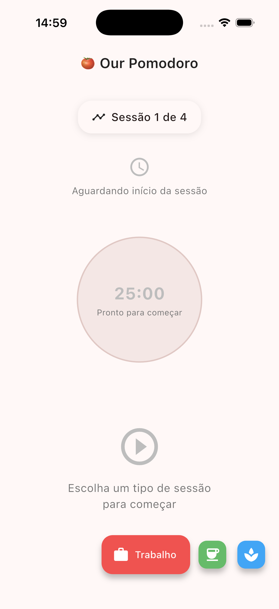
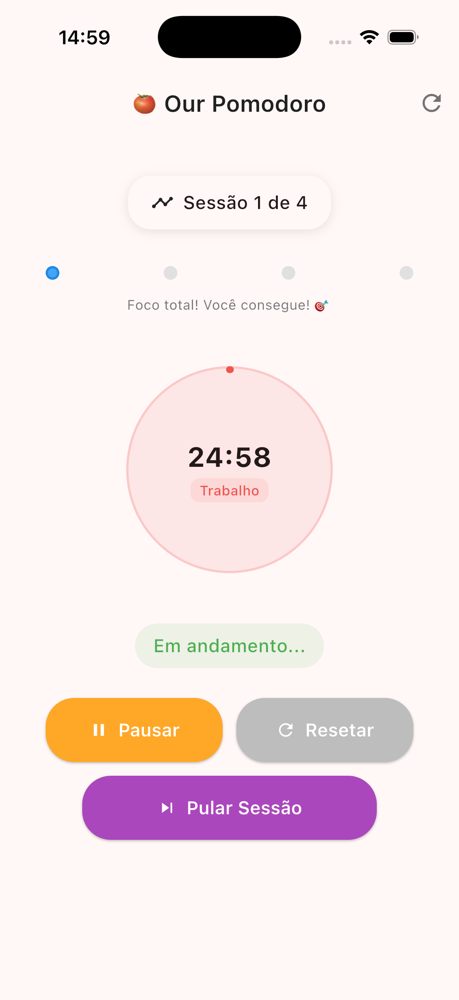
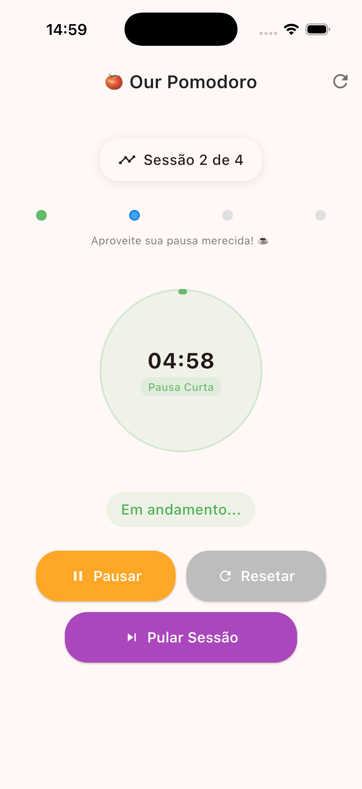
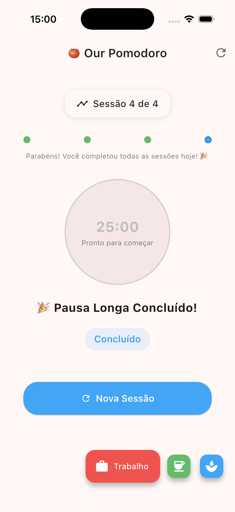
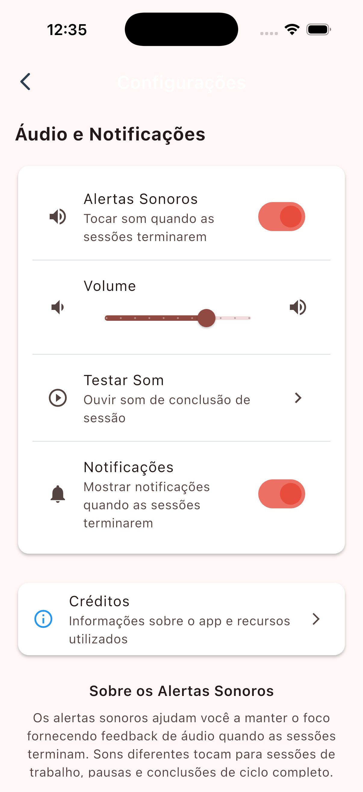
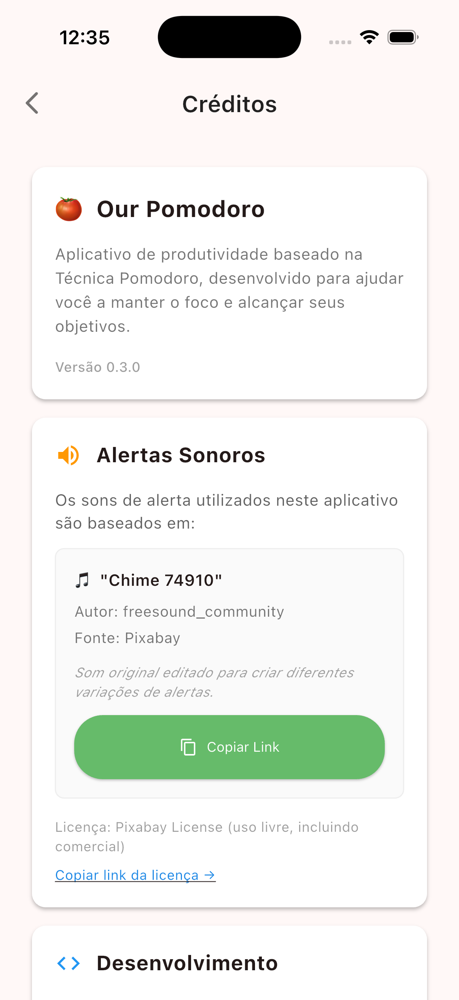

# 🍅 Our Pomodoro

<div align="center">
  
  
  
  
  
</div>

<div align="center">
  
  
  
</div>

<div align="center">
  <h3>🎯 Maximize your productivity with the Pomodoro Technique</h3>
  <p>A beautiful, clean, and efficient Pomodoro Timer app built with Flutter following Clean Architecture principles.</p>
</div>

---

## ✨ Features

### 🎯 **Current Features (v0.3.2)**
- 🍅 **Complete Pomodoro Timer** - Full timer functionality with start/pause/resume/reset ✅
- ⏱️ **Accurate Background Timer** - Timestamp-based calculation that works perfectly in background ✅
- 🔔 **Scheduled Notifications** - Get notified even if app is closed or killed by system ✅
- ⏭️ **Skip Session** - Skip current session and auto-start next one ✅
- 🔄 **Auto Transitions** - Seamless flow between work and break sessions ✅
- 📊 **Session Progress** - Real-time counter and visual progress indicators ✅
- 🔊 **Sound Alerts** - Custom audio notifications for session completions ✅
- 📱 **Push Notifications** - Background notifications with robust permission handling ✅
- 🌍 **Auto Timezone Detection** - Works correctly in any timezone worldwide ✅
- 🇧🇷 **Portuguese Interface** - Complete localization for Brazilian users ✅
- ⚙️ **Advanced Settings** - Volume control, sound/notification toggles ✅
- 🏆 **Credits System** - Proper attribution for sounds and libraries ✅
- 🎛️ **Smart Controls** - Context-aware controls that adapt to session state ✅
- 💾 **Session Persistence** - Resume your session after app restart ✅
- 🏗️ **Clean Architecture** - Maintainable, testable, and scalable codebase ✅
- 🧪 **Comprehensive Testing** - 57+ automated tests ensuring reliability ✅
- 📱 **Cross Platform** - Works on Android and iOS (build for iOS requires macOS) ✅
- 📡 **Offline First** - All data stored locally, works without internet ✅
- 🌙 **Basic Dark Theme** - System-based theme switching (needs UI improvements) ✅

### 🔧 **Technical Foundation Complete**
- 📦 **Dependency Injection** - GetIt setup with manual configuration ✅
- 🏛️ **Domain Layer** - Entities, repositories, and use cases ✅
- 💾 **Data Layer** - Local storage with SharedPreferences ✅
- 🎛️ **State Management** - BLoC pattern implementation ✅

### 📋 **Planned Features**
- ⚙️ **Customizable Settings** - Adjust timer durations to your preference
- 📊 **Productivity Statistics** - Track your focus sessions and streaks
- 🌙 **Enhanced Dark Theme** - Improve dark theme UI/UX design
- 🎨 **Multiple Themes** - Additional color schemes and customization options
- 📱 **iOS Native Interface** - Cupertino widgets for authentic iOS experience
- 🔄 **Adaptive Design** - Platform-specific widgets that feel native on each OS
- 🎵 **Multiple Sound Themes** - Different notification sound sets
- 🌍 **Multiple Languages** - Support for additional languages beyond Portuguese

## 📱 Screenshots

### 🎯 Complete App Interface (v0.3.2)

<div align="center">

| Initial State | Work Session | Short Break | Session Complete |
|:-------------:|:------------:|:-----------:|:----------------:|
|  |  |  |  |
| Ready to start your first Pomodoro session | 25-minute focus timer with progress tracking | 5-minute break with relaxing interface | Session completed with next action options |

</div>

<div align="center">

| Settings Screen | Credits Screen |
|:---------------:|:--------------:|
|  |  |
| Complete audio and notification controls | Proper attribution for sounds and libraries |

</div>

### ✨ **Interface Highlights**

- **🎯 Clean, Distraction-Free Design** - Minimalist interface that keeps you focused
- **⏰ Circular Progress Timer** - Visual countdown with smooth animations
- **📊 Session Progress Tracking** - Dots showing your progress through the 4-session cycle
- **🎛️ Smart Control Buttons** - Context-aware controls (Start/Pause/Skip/Reset)
- **🔄 Seamless Transitions** - Automatic flow between work sessions and breaks
- **📱 Responsive Design** - Looks great on phones and tablets
- **⚙️ Advanced Settings** - Complete audio and notification control panel
- **🏆 Credits System** - Proper attribution with clickable links and licensing info
- **🔔 Notification Testing** - Platform-specific notification testing (Android only)
- **🎵 Sound Management** - Volume control, sound testing, and audio preferences

### 🎨 **Visual Features**
- **Material Design 3** components with modern styling
- **Intuitive Color Coding** - Different colors for work (red) and break (green/blue) sessions
- **Real-time Updates** - Session counter and timer update smoothly
- **Confirmation Dialogs** - Prevents accidental actions with user-friendly prompts
- **System Theme Support** - Automatically follows system dark/light mode (basic implementation)
- **Portuguese Localization** - Complete interface in Brazilian Portuguese
- **Card-based Layout** - Clean, organized settings and credits screens
- **Interactive Elements** - Sliders, switches, and buttons with smooth animations
- **Platform-aware UI** - Features adapt based on the platform (Android/iOS)

### 🔄 **Complete App Experience Demo**

Our Pomodoro follows the classic Pomodoro Technique with intelligent automation and comprehensive features:

#### **Core Timer Flow:**
1. **🚀 Start** → Choose work session from floating buttons
2. **⏰ Focus** → 25-minute timer with progress visualization
3. **✅ Complete** → Automatic transition to 5-minute break
4. **☕ Break** → Relax while the break timer counts down
5. **🔄 Repeat** → Automatic cycle progression (4 work sessions + breaks)
6. **🎯 Long Break** → 15-minute break after completing 4 work sessions
7. **🏁 Finish** → Complete cycle with option to start fresh

#### **Enhanced Features:**
- **⏭️ Skip Feature**: Need to move on? Skip any session instantly with the purple "Skip Session" button!
- **⚙️ Settings Access**: Tap the gear icon to access comprehensive audio and notification settings
- **🔊 Sound Control**: Adjust volume, test sounds, and customize audio alerts
- **📱 Notification Management**: Enable/disable notifications with platform-specific testing
- **🏆 Credits & Attribution**: View complete information about sounds and libraries used
- **🇧🇷 Portuguese Interface**: Fully localized experience for Brazilian users

## 🚀 Getting Started

### Prerequisites

Before you begin, ensure you have the following installed:

- [Flutter](https://flutter.dev/docs/get-started/install) (3.9.2 or later)
- [Dart](https://dart.dev/get-dart) (3.0.0 or later)
- [Android Studio](https://developer.android.com/studio) or [VS Code](https://code.visualstudio.com/)
- Android SDK (for Android development)
- Xcode (for iOS development - macOS only)

### Installation

1. **Clone the repository**
   ```bash
   git clone https://github.com/Penfore/our-pomodoro.git
   cd our-pomodoro
   ```

2. **Install dependencies**
   ```bash
   flutter pub get
   ```

3. **Run the app**
   ```bash
   flutter run
   ```

### Build for Production

**Android (APK)**
```bash
flutter build apk --release
```

**Android (App Bundle)**
```bash
flutter build appbundle --release
```

**iOS (requires macOS)**
```bash
flutter build ios --release
```

> 📱 **Platform Notes**:
> - **Android**: Fully tested and APK available in releases
> - **iOS**: Buildable on macOS, but not officially distributed yet
> - **Cross-platform compatibility**: Same codebase works on both platforms

## 🏗️ Architecture

This project follows **Clean Architecture** principles, ensuring:

- **Separation of Concerns** - Each layer has a single responsibility
- **Dependency Inversion** - High-level modules don't depend on low-level modules
- **Testability** - Easy to unit test business logic
- **Maintainability** - Easy to modify and extend

### Project Structure

```
lib/
├── core/                     # Shared functionality
│   ├── constants/           # App constants
│   ├── error/              # Error handling
│   ├── network/            # Network utilities
│   ├── platform/           # Platform specific code
│   ├── theme/              # App theming
│   └── usecase/            # Base use case interface
├── features/               # Feature modules
│   └── pomodoro/          # Pomodoro feature
│       ├── data/          # Data layer (models, repositories, datasources)
│       ├── domain/        # Domain layer (entities, repositories, use cases)
│       └── presentation/  # Presentation layer (pages, widgets, BLoC)
├── injection_container.dart # Dependency injection setup
└── main.dart              # App entry point
```

### Tech Stack

- **Framework**: Flutter 3.9.2+
- **Language**: Dart 3.0+
- **State Management**: Flutter BLoC
- **Dependency Injection**: GetIt
- **Local Storage**: SharedPreferences
- **Functional Programming**: Dartz (Either, Option)
- **Testing**: Flutter Test, BLoC Test, Mocktail

## 🧪 Testing

Run all tests:
```bash
flutter test
```

Run tests with coverage:
```bash
flutter test --coverage
```

View coverage report:
```bash
genhtml coverage/lcov.info -o coverage/html
open coverage/html/index.html
```

## 📋 Development Roadmap

### Phase 1: Core Foundation ✅
- [x] Clean Architecture setup
- [x] Dependency injection
- [x] Basic BLoC structure
- [x] Data models and entities

### Phase 2: Timer Implementation ✅
- [x] Timer functionality (start/pause/resume/reset)
- [x] Session transitions and automatic flow
- [x] Skip session functionality
- [x] Session progress tracking and visual indicators
- [x] Circular progress timer with responsive design
- [x] Session state persistence

### Phase 3: Enhanced Experience ✅
- [x] Modern, intuitive timer interface
- [x] Material Design 3 components
- [x] Basic dark/light theme (needs improvements)
- [x] Sound alerts and notifications (v0.3.0)
- [x] Robust notification system (v0.3.1)
- [ ] Enhanced dark theme design
- [ ] Smooth animations and transitions
- [ ] Multiple color themes
- [ ] Advanced responsive design

### Phase 4: Platform-Specific Features 📝
- [ ] iOS native interface with Cupertino widgets
- [ ] Adaptive design that feels native on each platform
- [ ] Platform-specific animations and transitions
- [ ] iOS-style navigation and interactions
- [ ] Android Material You theming

### Phase 5: Advanced Features 📝
- [ ] Statistics dashboard
- [ ] Customizable settings (timer durations)
- [ ] Multiple sound themes
- [ ] Export data functionality
- [ ] Multiple language support

### Phase 6: Platform Integration 📝
- [ ] Background execution and notifications
- [ ] iOS App Store distribution
- [ ] System integration improvements
- [ ] Accessibility features
- [ ] Performance optimizations

## 🤝 Contributing

We love contributions! Please read our [Contributing Guide](CONTRIBUTING.md) to learn about our development process.

### Quick Start for Contributors

1. **Fork** the repository
2. **Create** a feature branch (`git checkout -b feature/AmazingFeature`)
3. **Commit** your changes (`git commit -m 'Add some AmazingFeature'`)
4. **Push** to the branch (`git push origin feature/AmazingFeature`)
5. **Open** a Pull Request

### Development Guidelines

- Follow [Effective Dart](https://dart.dev/guides/language/effective-dart) guidelines
- Write meaningful commit messages
- Add tests for new features
- Update documentation as needed
- Ensure code passes `flutter analyze`

### Types of Contributions

- 🐛 **Bug reports** - Help us identify issues
- 💡 **Feature requests** - Suggest new functionality
- 🔧 **Code contributions** - Implement features or fix bugs
- 📚 **Documentation** - Improve docs and examples
- 🎨 **Design** - UI/UX improvements
- 🌍 **Translations** - Help localize the app

## 🤖 AI-Assisted Development

This project embraces modern development practices and acknowledges the role of AI in today's software development landscape.

### Our Position on AI

- 🎯 **AI as a Tool**: We recognize that AI tools (like GitHub Copilot, ChatGPT, etc.) are valuable assistants that help developers learn, explore new technologies, and increase productivity
- 👥 **Human Review Required**: While AI can assist with code generation and problem-solving, **all code must be reviewed, understood, and validated by real humans** before being merged
- 🧠 **Learning Enhancement**: AI tools are excellent for learning new patterns, understanding complex architectures, and exploring different implementation approaches
- 🔍 **Quality Assurance**: Contributors should always understand the code they're submitting, regardless of how it was generated

### Guidelines for AI-Assisted Contributions

- ✅ **Use AI tools** to help with boilerplate code, documentation, or learning new concepts
- ✅ **Review and understand** all AI-generated code before submitting
- ✅ **Test thoroughly** - AI-generated code should be tested just like any other code
- ✅ **Document your approach** - If AI helped solve a complex problem, consider documenting the solution for others
- ❌ **Don't blindly copy-paste** AI-generated code without understanding it
- ❌ **Don't rely solely on AI** for architectural decisions or critical business logic

### The Human Touch

While we embrace AI assistance, we believe in:
- **Human creativity** in solving complex problems
- **Human judgment** in making architectural decisions
- **Human empathy** in understanding user needs
- **Human responsibility** for code quality and security

This project is built by humans, for humans, with AI as a helpful companion in our development journey.

## 📄 License

This project is licensed under the MIT License - see the [LICENSE](LICENSE) file for details.

## 👥 Authors & Contributors

- **[Fúlvio Leo]** - *Initial work* - [@Penfore](https://github.com/Penfore)

See also the list of [contributors](https://github.com/Penfore/our-pomodoro/contributors) who participated in this project.

## 📞 Support & Community

- 🐛 **Issues**: [GitHub Issues](https://github.com/Penfore/our-pomodoro/issues)
- 💬 **Discussions**: [GitHub Discussions](https://github.com/Penfore/our-pomodoro/discussions)
- 📧 **Email**: fulvioleo.dev@pm.me

## 🙏 Acknowledgments

- Inspired by the [Pomodoro Technique](https://en.wikipedia.org/wiki/Pomodoro_Technique) by Francesco Cirillo
- Built with [Flutter](https://flutter.dev/) by Google
- Icons provided by [Flutter Icons](https://flutter.dev/docs/development/ui/widgets/icon)
- Thanks to all [contributors](https://github.com/Penfore/our-pomodoro/contributors)

## 📈 Project Stats

<div align="center">


</div>

---

<div align="center">
  <p>Made with ❤️ and ☕ by developers, for developers</p>
  <p>If this project helped you, please consider giving it a ⭐!</p>
</div>
